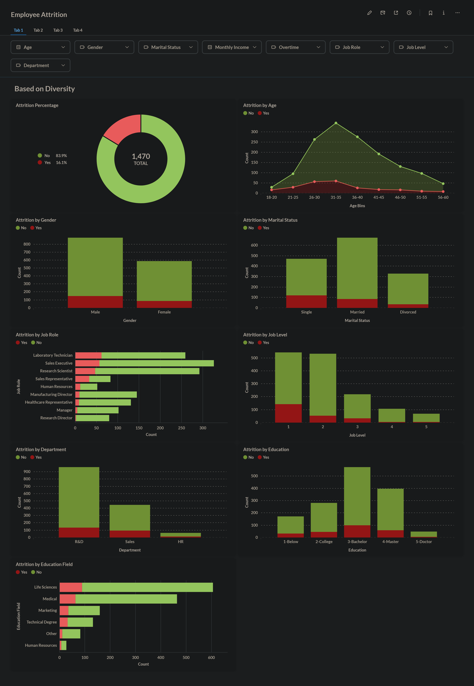
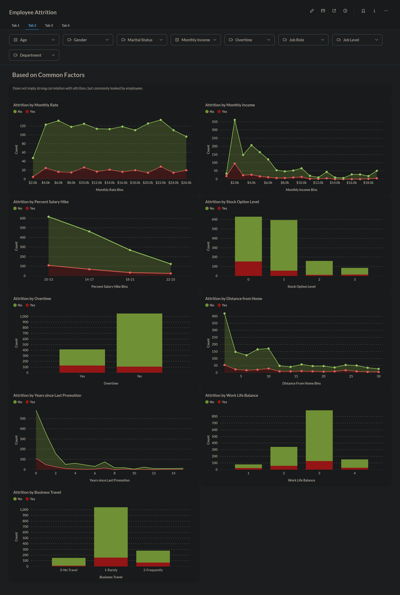
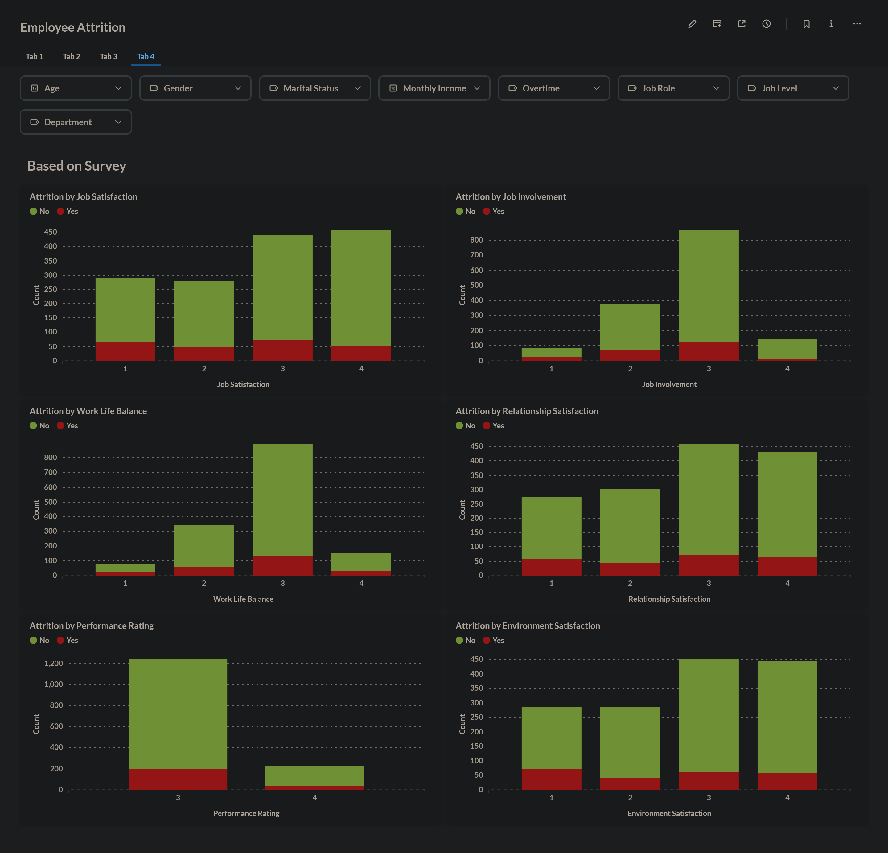
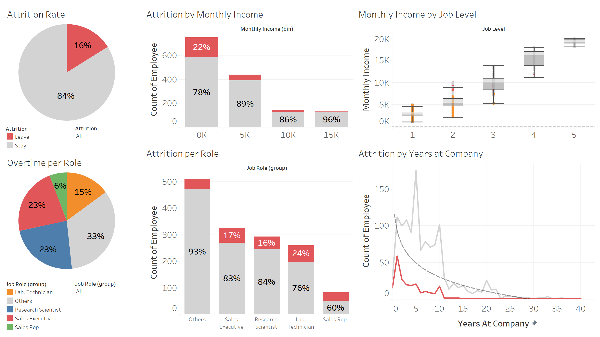

# HR: Employee Attrition Analysis

- Identify main factors of employee atrrition using Metabase/Tableau
- Employee data contains 1470 rows (1058 for train, 412 for test)
- Predict employee attrition likelihood using ensemble neural network (82% accuracy, 72% macro F1)

## Predict using CLI

1. Install all Python requirements (`pip install -r requirements.txt`)
2. Run the prediction script (`python prediction.py`)
3. By default, the model look at `data/employee_data.csv` to predict attrition. If the file is not found, you can type and enter another path manually (or just drag the CSV file to the terminal app)
4. Prediction output will be saved to `model/model_output.csv` (can be changed by editing `prediction.py`)

## Predict using REST API Server

1. Install all Python requirements (`pip install -r requirements.txt`)
2. Run `uvicorn main:app --host 127.0.0.1 --port 8000` to start the backend server (`--host 0.0.0.0` if using Docker)
3. Upload a CSV file to the server (e.g. via cURL):
``` sh
curl -X POST 'http://127.0.0.1:8000/predict_file' \
  -H 'accept: application/json' \
  -H 'Content-Type: multipart/form-data' \
  -F 'file=@data/employee_data.csv'
```
4. Or send it as JSON data directly:
``` sh
curl -X POST 'http://127.0.0.1:8000/predict' \
  -H 'accept: application/json' \
  -H 'Content-Type: application/json' \
  -d '{"columns":["EmployeeId","Age","Attrition","BusinessTravel","DailyRate","Department","DistanceFromHome","Education","EducationField","EmployeeCount","EnvironmentSatisfaction","Gender","HourlyRate","JobInvolvement","JobLevel","JobRole","JobSatisfaction","MaritalStatus","MonthlyIncome","MonthlyRate","NumCompaniesWorked","Over18","OverTime","PercentSalaryHike","PerformanceRating","RelationshipSatisfaction","StandardHours","StockOptionLevel","TotalWorkingYears","TrainingTimesLastYear","WorkLifeBalance","YearsAtCompany","YearsInCurrentRole","YearsSinceLastPromotion","YearsWithCurrManager"],"data":[[1,38,null,"Travel_Frequently",1444,"Human Resources",1,4,"Other",1,4,"Male",88,3,1,"Human Resources",2,"Married",2991,5224,0,"Y","Yes",11,3,2,80,1,7,2,3,6,2,1,2],[2,37,1,"Travel_Rarely",1141,"Research & Development",11,2,"Medical",1,1,"Female",61,1,2,"Healthcare Representative",2,"Married",4777,14382,5,"Y","No",15,3,1,80,0,15,2,1,1,0,0,0],[3,51,1,"Travel_Rarely",1323,"Research & Development",4,4,"Life Sciences",1,1,"Male",34,3,1,"Research Scientist",3,"Married",2461,10332,9,"Y","Yes",12,3,3,80,3,18,2,4,10,0,2,7]]}'
```

Note: The FastAPI docs page is also accessible via `127.0.0.1:8000/docs`, you can make mock request and view request history there

### Running Server on Docker

1. Build the image using `docker build -t hr-attrition .` (on the same dir as `Dockerfile`)
2. Run it as container using `docker run --name test -p 8000:8000 hr-attrition` (or use `-dp` for background/detached mode)
3. To stop the container, press Ctrl + C or using `docker stop test`
4. To run it again, use `docker start test` instead of `docker run ...` (to prevent creating duplicate container)
5. Delete the container using `docker rm test` and the image using `docker rmi hr-attrition` if no longer needed

## Dashboard

The dashboard is split into 4 separate tabs for easier analysis, which can be seen below. You can also see the detailed conclusions and recommended actions [here](dashboard/README.md)

<details>
    <summary>Metabase screenshots</summary>
    <p align="center">
        
        
        
        
    </p>
</details>

I also made a Tableau version, with only the important charts, and a [presentation file](misc/HR%20Attrition.pdf) file based on it

<details>
    <summary>Tableau screenshot</summary>
    <p align="center">
        
    </p>
</details>