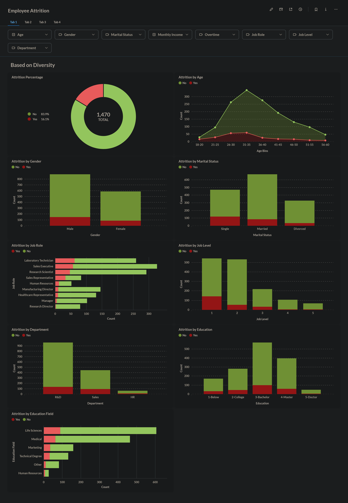
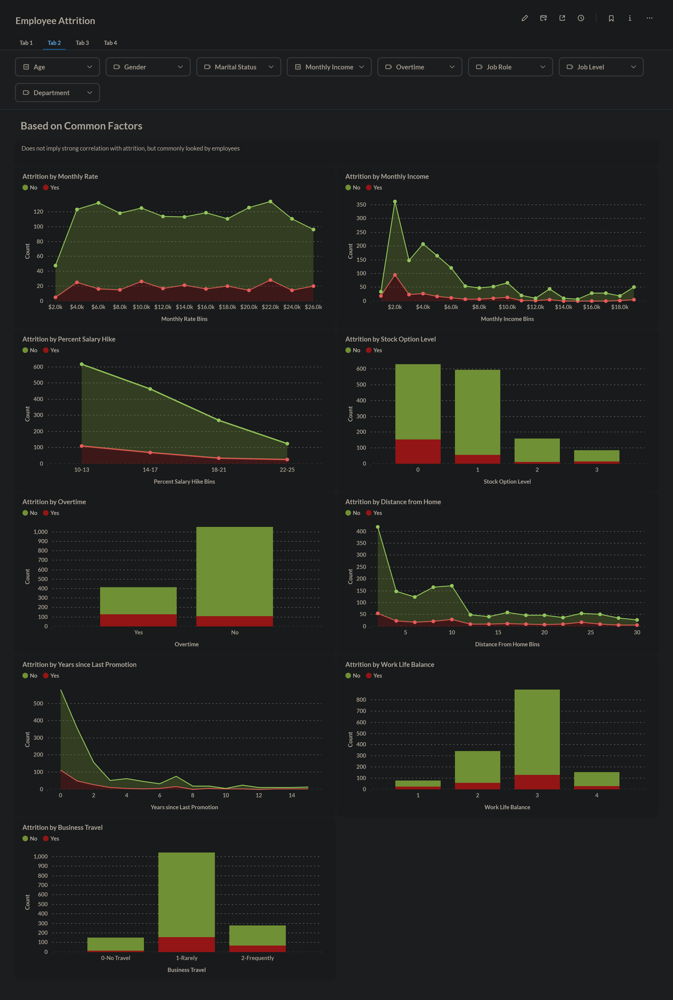
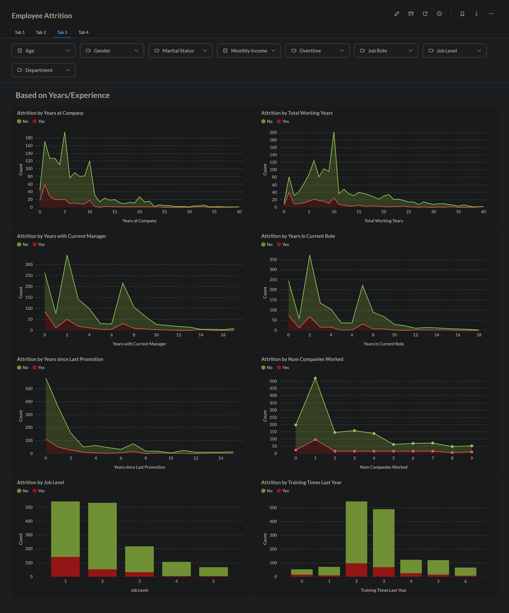

# HR: Employee Attrition Analysis

- Identify main factor of employee atrrition using Metabase
- Predict employee attrition likelihood using ensemble neural network (82% accuracy, 70% macro F1) 

## Predicting using the Model

1. Install all Python requirements (`pip install requirements.txt`)
2. Run the prediction script (`python prediction.py`)
3. By default, the model look at `data/employee_data.csv` to predict attrition. If the file is not found, you can type and enter another path manually (or just drag the CSV file to the terminal app)
4. Prediction output will be saved to `model/model_output.csv` (can be changed by editing `prediction.py`)

**TODO:** Create an interactive web app to access the model

## Dashboard

The dashboard is split into 4 separate tabs for easier analysis, which can be seen below. You can also see the conclusions and recommended actions [here](dashboard/README.md).

    
Show screenshots

    

        
        
        
        
    

